# (WIP) [超簡単] Dify x Amazon Bedrockを使ったセキュリティオペレーション自動化

## セキュリティオペレーションの自動化実現にはLLMの相性が良い

こんにちは。サイバーエージェントのシステムセキュリティ推進グループの小笠原と申します。
私は普段、セキュリティ部署の技術チームに所属しインハウスのセキュリティエンジニアとしてセキュリティ対応を行っています。
技術チームではテクノロジーを駆使して、セキュアな開発環境の構築・提供や、オペレーションの自動化を行っています。

昨今、LLMの進歩によりセキュリティオペレーションの自動化がさらに加速しています。
AWSではAmazon GuardDutyなどの既存のセキュリティサービスと Amazon Bedrockの生成AIサービスを組み合わせることで、
セキュリティオペレーションの自動化を効率よく実現することができるようになりました。

### ノーコード・ローコードで自動化を実現する

去年〜今年にかけてLLMの周辺ツールがますます充実したことで、LLMのテクノロジーがさらに使いやすくなってきました。
今回は [Dify](https://dify.ai/) というツールを使い、ほぼノーコードでセキュリティオペレーションの自動化を実現していきます。

### 完成図

構築する仕組みは以下のような構成になります。

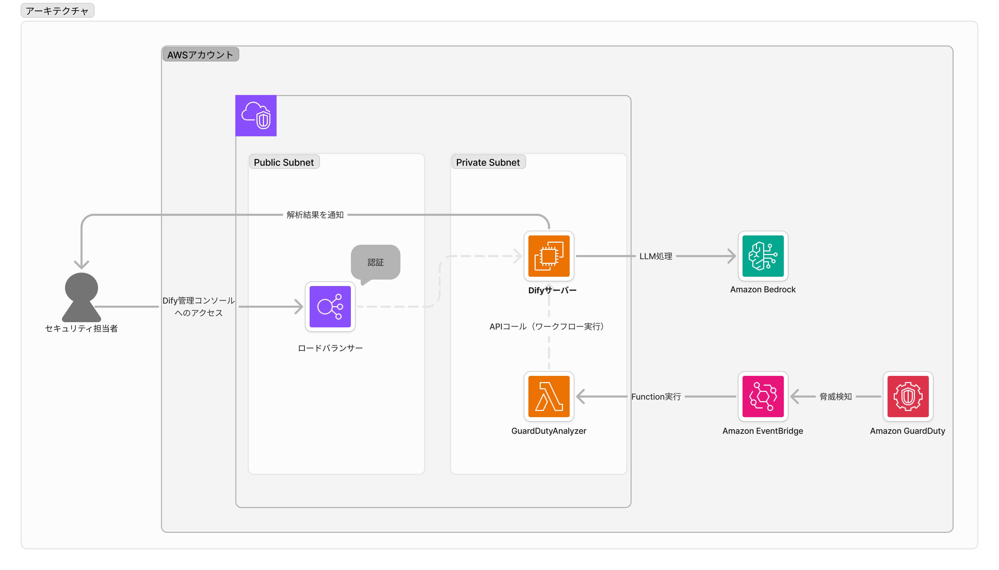

- Difyサーバの構築
  - Difyを使ってセキュリティオペレーションのワークフローを作成します
  - ワークフロー内では、Amazon Bedrockを使って生成AIで処理を実行します
  - サーバ構築ではコンテナイメージが提供されているのでそれらを起動するのみです
- Amazon GuardDutyのセキュリティイベントを解析
  - 今回は脅威検知の解析を自動化します
  - セキュリティの専門知識がない人でも分かりやすく状況把握できるものを目指します
- Amazon Bedrockを使ってLLMのAPIを呼び出す
  - BedrockのAPIを呼び出すには通常、DifyサーバにIAMユーザのキーを登録する必要があります
  - しかし、今回はEC2にIAMロールを割り当てることで、IAMユーザを作成する必要がなくなりセキュアになります

## Difyサーバの構築

まずは、メインとなるDifyサーバを構築します。

今回は自身のAWSアカウントでDifyサーバをホストしますが、SaaSサービスとしても提供されていますので、SaaS利用が可能であればさらにお手軽に環境を用意できます。
ただし、セキュリティオペレーションで扱われるデータはセンシティブなものも含まれる可能性があるため、自分たちの環境にホストする方法をご案内します。

### EC2インスタンス作成
Difyに求められるCPU、MEMの要件に注意しつつ、以下のようなインスタンスを作成します。

- `AMI`: Amazon Linux 2023
- `Instance type`: t3.medium (2vCPU, 4GB MEMが必要)
- `セキュリティグループ`: インバウンドルールにHTTP(80)を追加
- その他は任意です

### docker install
EC2インスタンスが作成できたらコンテナを実行するためのdockerをインストールします。

```bash
$ sudo dnf install docker git
$ sudo usermod -a -G docker ssm-user # またはec2-user
$ sudo systemctl enable docker
$ sudo systemctl start docker
$ docker -v
Docker version 25.0.3, build 4debf41

# ここで一度ログアウトして、再度ログインする。（グループが反映されてdockerコマンドが使えるようになる）
```

### docker compose install
Difyは `docker compose` を使ってコンテナを実行できます。
最新のインストール方法は[公式ドキュメント](https://matsuand.github.io/docs.docker.jp.onthefly/compose/install/)を参照してください。

```bash
$ DOCKER_CONFIG=${DOCKER_CONFIG:-$HOME/.docker}
$ mkdir -p $DOCKER_CONFIG/cli-plugins
$ curl -SL https://github.com/docker/compose/releases/download/v2.29.1/docker-compose-linux-x86_64 -o $DOCKER_CONFIG/cli-plugins/docker-compose
$ chmod +x $DOCKER_CONFIG/cli-plugins/docker-compose
$ docker compose version
Docker Compose version v2.29.1
```

### Difyサーバの立ち上げ
DifyはOSSとして公開されていますので、GitHubから[ソースコード](https://github.com/langgenius/dify.git)をダウンロードし、サーバを立ち上げます。

```bash
$ git clone https://github.com/langgenius/dify.git
$ cd dify/docker
$ cp .env.example .env
$ docker compose up -d
```

Difyには複数のサービスが含まれていることがわかります。
今回は利用しないサービスもありますが、それぞれのサービスの役割・特徴は以下のようになります。

```bash
$ docker compose ps --services
api       # バックエンドのAPI(Python)
db        # DB(PostgreSQL)
nginx     # nginx(リバースプロキシ)
redis     # Redis
sandbox
ssrf_proxy 
weaviate   # ベクトルストア（他のOSSを選択可能）
web        # フロントエンド(Next.js)
worker     # ワーカー
```

ベクトルストアはweaviateがデフォルトで利用できますが、他のOSSを選択することも可能です。

### Difyサーバへのアクセスコントロール

ここまでで、Difyサーバの立ち上げは完了です。
デフォルトではhttpsでのアクセス（通信の暗号化）は対応していません。
お使いの環境にあわせていくつかの選択肢があります。

- Dify内のnginx設定を修正して直接SSL/TLS終端する
- ALBを使ってSSL/TLS終端してからDifyサーバにルーティングする
- VPNで内部ネットワークにトンネルしてhttpでアクセスする

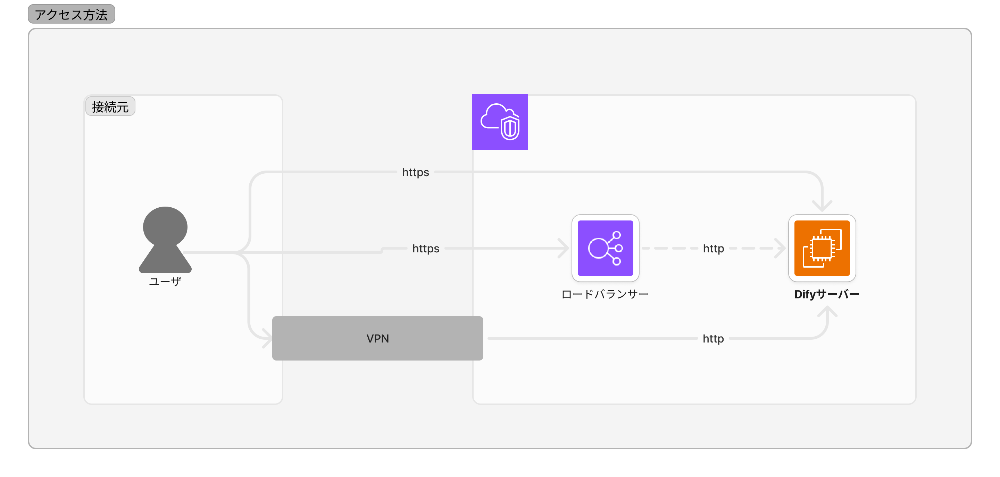

今回はALBを使う手順を記載します。ALB側でIPアドレス制限やOIDC認証（Cognitoなど）を挟むことができます。また、Difyサーバを直接インターネットフェーシングにせずに済むためサーバの脆弱性リスクを軽減できます。

#### ALBの作成

まずはターゲットグループを作成します。
- ターゲットの種類は「インスタンス」を指定し、先ほど作成したEC2インスタンスを登録
- ヘルスチェック設定は以下を指定
  - `パス`: /signin
  - `ステータス`: 200

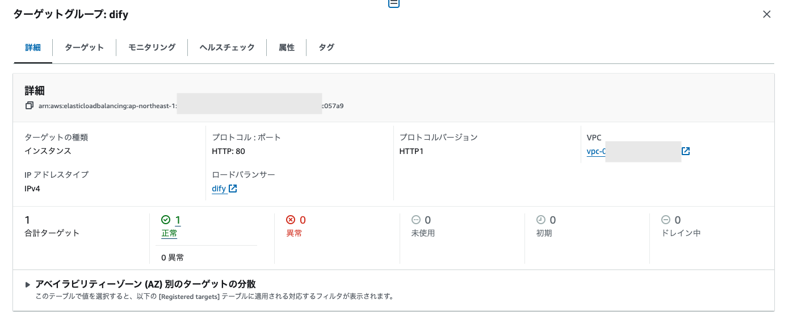
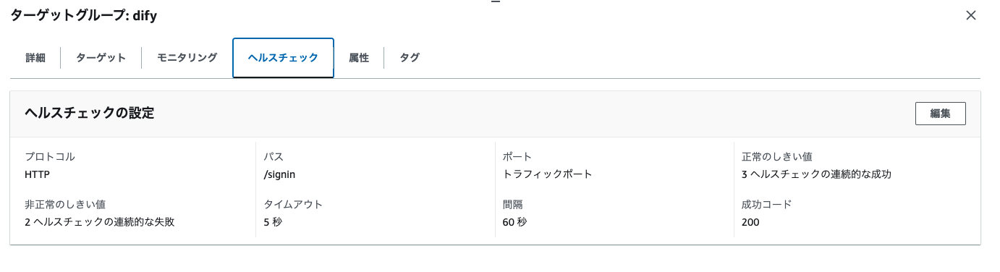

ALBの作成
- 転送先のターゲットグループは先程作成したものを指定
- 適切なセキュリティグループを指定
  - https(443)を許可するセキュリティグループを指定
  - IP制限をかける場合はここで設定（オプション）
- リスナールールを追加
  - ここで認証の設定も可能（オプション）

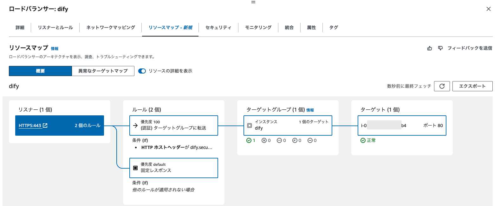

Difyの管理コンソールにアクセス
- 以下のURLにアクセスして管理者ユーザを作成してください
  - https://{ALBのDNS名またはIPアドレス}/install

カスタムのドメインを使用する場合は、別途ACMなどの設定が必要です。
管理者ユーザの作成が完了したらログインしてください。

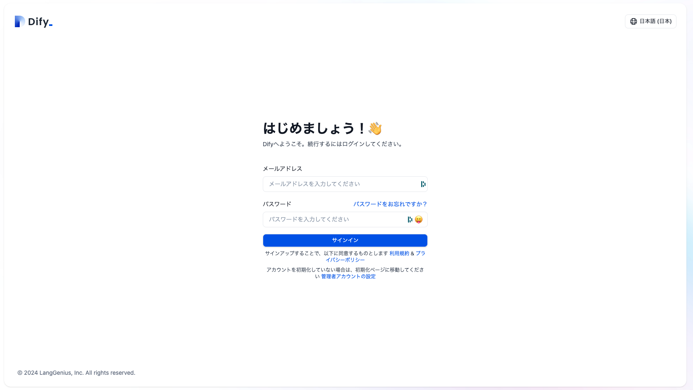

## Difyの設定

Difyサーバが構築できたらAmazon Bedrockを利用できるように準備します。

### モデルの有効化

リージョンは任意ですが、今回は `バージニア(us-east-1)` で有効化の設定を行います。
LLM界隈はアップデートが激しく最新のLLMモデルを利用するにはバージニアで有効化しておくとすぐに利用できる可能性が高まります。

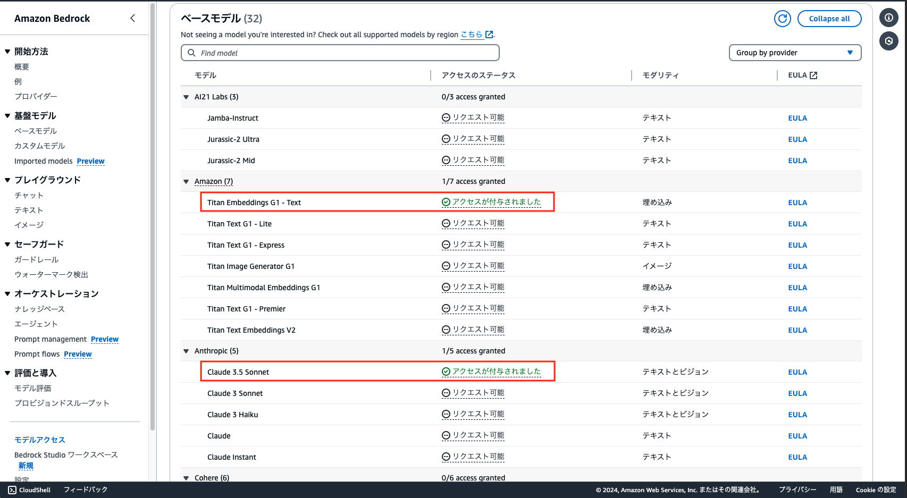

今回は以下の２つのモデルを有効化しました。

- `Amazon Titan Embeddings G1 - Text` (ベクトル検索で利用)
- `Anthropic Claude 3.5 Sonnet` (チャットやテキスト生成で利用)

### Bedrockの設定

DifyサーバからAmazon Bedrockを呼び出すための権限を設定します。

- 以下のポリシーでIAMロールを作成し、Difyサーバー（EC2）にロールを割り当てます
```json
{
    "Version": "2012-10-17",
    "Statement": [
        {
            "Effect": "Allow",
            "Action": "bedrock:InvokeModel*",
            "Resource": [
                "*"
            ]
        }
    ]
}
```

### Difyのモデル設定

Difyのコンソール画面にログインして右上のメニューから「設定」を選択します。

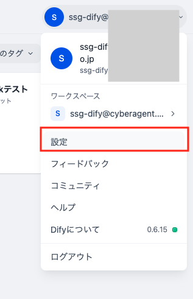

設定画面の「モデルプロバイダー」メニューを開き、`Amazon Bedrock`を探し「セットアップ」を選択します。

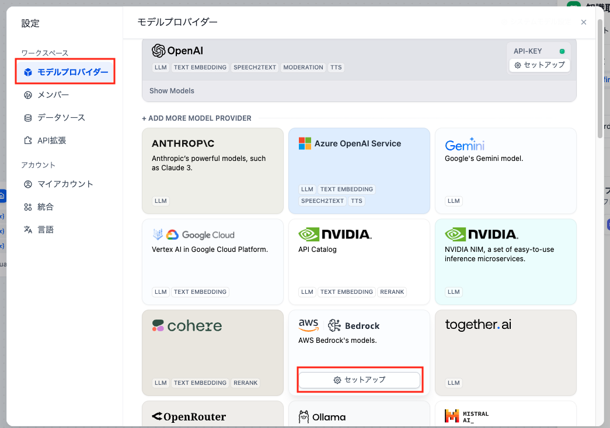

先ほど有効化したモデル `anthropic.claude-3-5-sonnet-20240620-v1:0` を入力し保存を選択します。
ここで利用可能な状態になっているかがチェックされます。

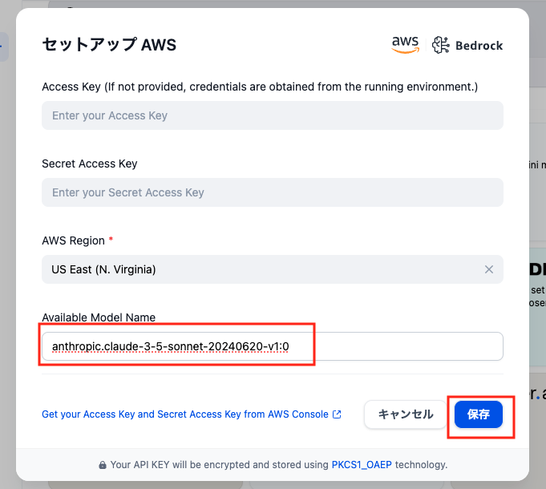

最後に、システムモデル設定で `Claude 3.5 Sonnet` と `amazon.titan-embed-text-v1` を選択し「保存」を選択します。

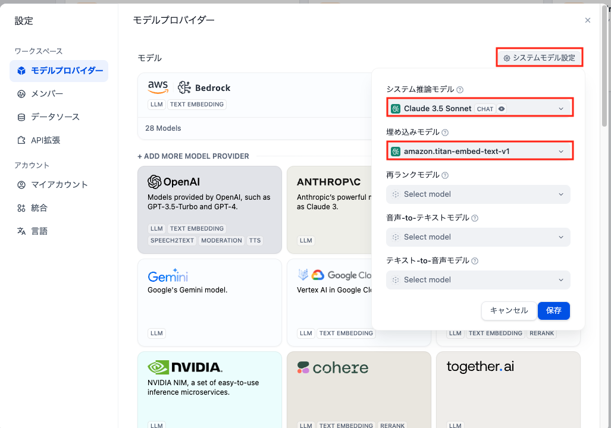

ここまででDifyからAmazon Bedrockを利用できるようになりました。

### ナレッジの登録

Amazon GuardDutyのFindingをLLMで解説させるために、公式のドキュメントをナレッジとして登録します。
ナレッジを利用するとRAGという手法でLLMにコンテキストを与えることができます。これにより、より具体的で正確な回答を得ることができます。

以下の２つのURLにアクセスし、`印刷 ＞ PDFに保存` でPDFファイルをダウンロードします。

- https://docs.aws.amazon.com/ja_jp/guardduty/latest/ug/guardduty_finding-types-ec2.html
- https://docs.aws.amazon.com/ja_jp/guardduty/latest/ug/guardduty_finding-types-iam.html

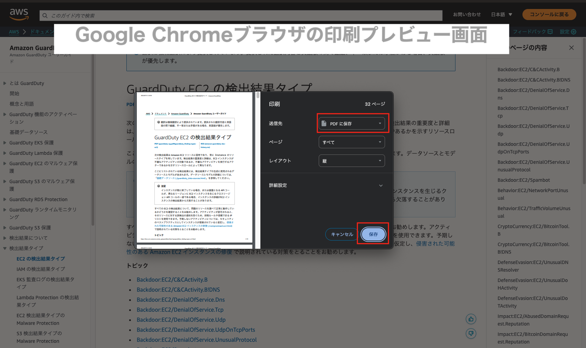

Difyのナレッジメニューで「知識を作成」を選択します

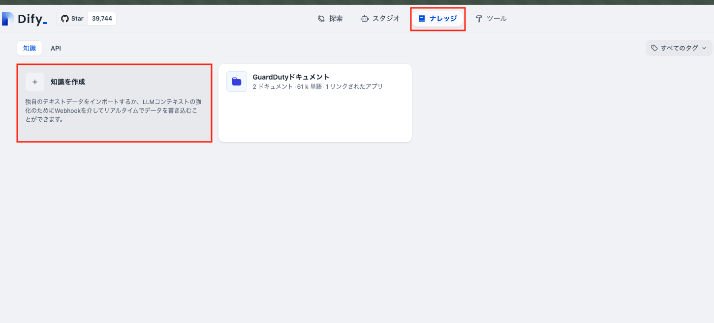

ナレッジの作成設定で、「質問と回答形式でセグメント化（使用言語: 日本語）」を有効にしてナレッジ作成を実行します。

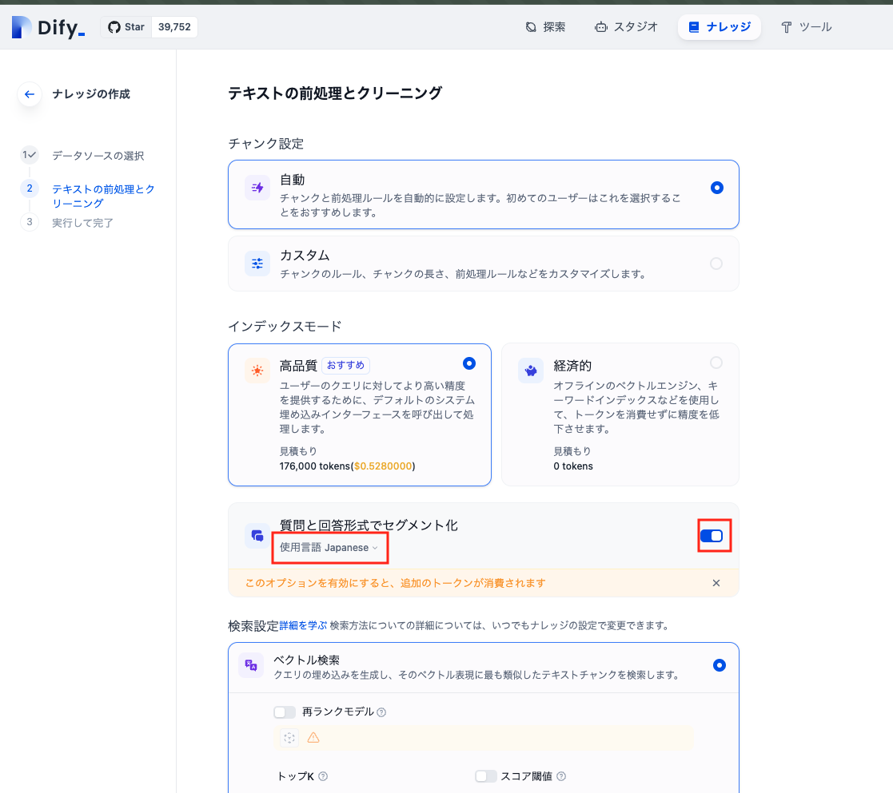

この設定でナレッジを作成する場合かなり時間がかかってしまいます。
ただ、ナレッジ作成においては適切なチャンキング処理（ドキュメントの分割）が非常に重要で、目的のデータをコンテキストに含めることができるかがポイントになります。（RAGと言われる手法）

ここは多少お金と時間がかかってしまいますが、我慢して待ちます。

### ワークフローを作成

いよいよ、セキュリティオペレーションの自動化＝ワークフロー定義の作成に入ります。

#### DSLファイルのインポート

ワークフローを一から作るのではなく事前に用意させてもらったDSLファイルをインポートし、自身の環境に合わせて少し修正します。

以下のURLからDSLファイルをダウンロードしてください

- https://github.com/gassara-kys/dify-example/blob/master/dsl/GuardDutyHandler.yml

メニューから `スタジオ` 画面に遷移し「DSLファイルをインポート」を選択して先ほどダウンロードしたDSLファイルをアップロードしてください。

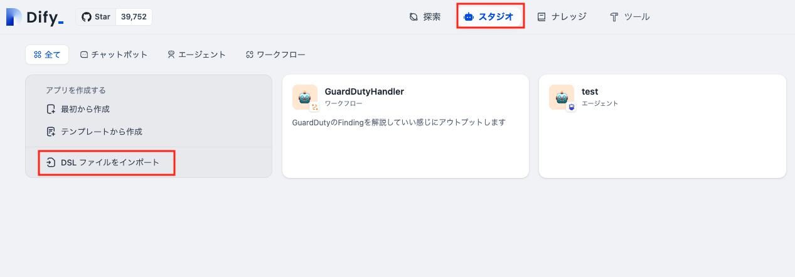

#### ワークフローの修正

インポートが完了するとGuardDutyHandlerというワークフローが作成されます。

しかし、このままではワークフローを実行することができません。以下の２点を修正します。

- ナレッジを選択する
- 通知先のSlack webhook URLを設定する

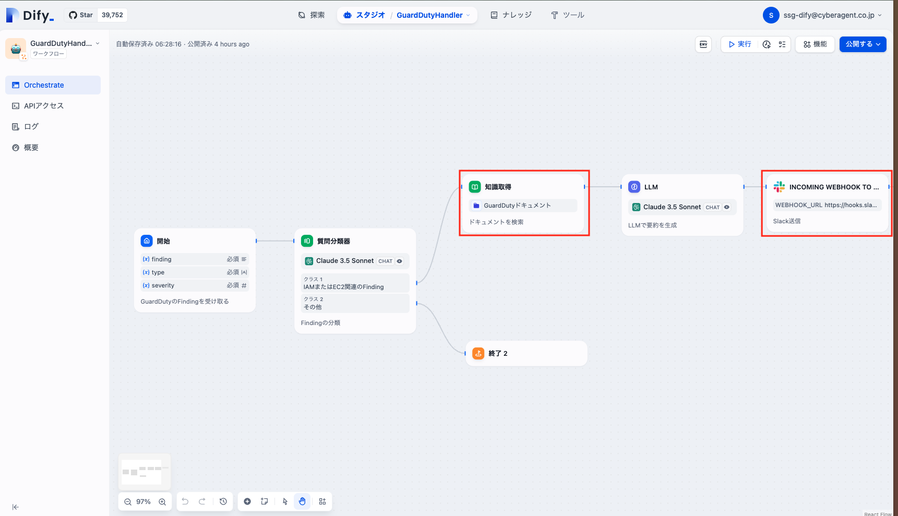

#### ワークフローのテスト

ワークフローのテストは右上の「実行」から行うことができます。

以下の必須パラメータを設定して実行します。

- finding: テスト用のJSONファイルを指定
- type: GuardDutyのFindingタイプを指定
- severity: 1.0 ~ 8.0の数字を指定

成功すると指定したSlackチャンネルに以下のような通知が飛んできます。

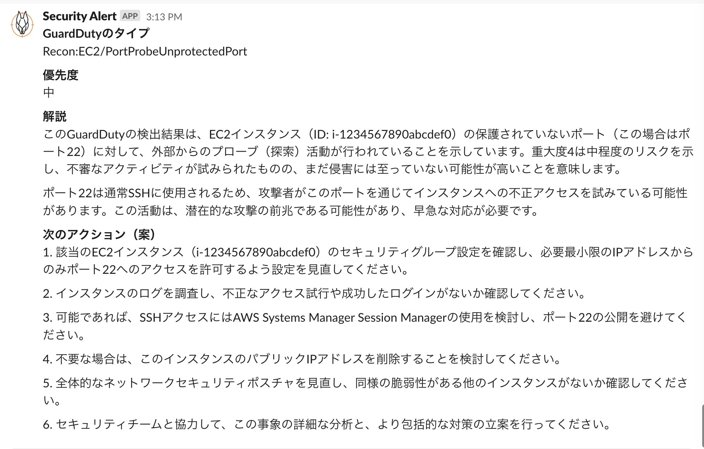

ダミーのデータになりますが、GuardDutyのFindingを解説し、次に何をすべきかをユーザに通知することができました。これを見ればセキュリティの専門家でなくても状況を把握できるようになります。

#### ワークフローの公開

設定が完了したら、右上の「公開する」を選択してください。

#### APIからワークフローを実行できるようにする

ワークフローが作成できたら、APIから実行できるようにします。

APIを有効にするには、左メニューの `APIアクセス` 画面に遷移して、`APIキー` を生成してください。

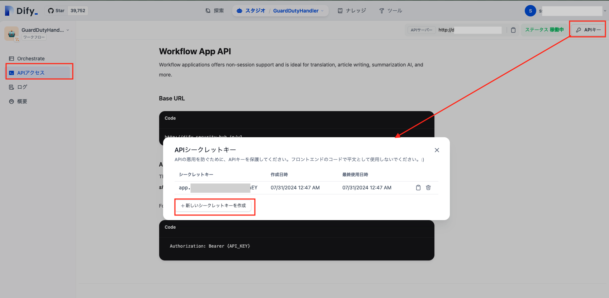

APIキーを使って以下のようなリクエストでワークフローを実行することが可能になります。

```bash
curl -X POST "http://${HOST}/v1/workflows/run" \
--header "Authorization: Bearer ${API_KEY}" \
--header 'Content-Type: application/json' \
--data-raw '{
    "inputs": {
      "type": "Recon:EC2/PortProbeUnprotectedPort",
      "severity": 4.0,
      "finding": "{...}",
    },
    "response_mode": "blocking",
    "user": "alice"
}'
```

## Amazon GuardDutyとDifyのワークフロー連携させる

最後に、Amazon GuardDutyのイベントをDifyのワークフローに連携させます。
以下のような構成でDifyのワークフローを呼び出すことにします。

`Amazon GuardDuty` → `Amazon EventBridge` → `AWS Lambda` → `Difyワークフロー(API)`

- GuardDuryを有効化します
- EventBridgeのルールを作成しLambda関数を呼び出すように設定します
- Lambda関数内で、GuardDutyのFindingイベントを取得、パースしてDifyのAPIにリクエストを送信します
- Difyがワークフローを実行し、解析結果がSlackに通知されます

この辺りの設定は今回の記事の趣旨から外れるため、ポイントを絞って記載します。

### AWS Lambda関数を作成

EventBridgeからイベントデータを受け取り、パースしてDifyのAPIにリクエストを送信するためのLambda関数を作成します。

- 新規にLambda関数を作成します
  - 関数名は「AnalyzeGuardDuty」とします
  - ランタイムは「Python 3.11」を選択します
  - 適切なIAMロールを設定します
- Lambdaコードはこちらからダウンロードして、zipファイルをアップロードしてください
  - https://github.com/gassara-kys/dify-example/blob/master/function/dist/AnalyzeGuardDuty.zip
- DifyのAPIの接続先情報を環境変数に設定します
  - `HOST`: DifyサーバのIPアドレス
  - `API_KEY`: 先ほど生成したDifyのAPIキー
- その他Lambdaの設定
  - タイムアウトは5分程度に設定してください（LLMの処理に数十秒かかる可能性があるため）
  - VPC設定で、Difyサーバが配置されているサブネットにアクセスできるようにしてください
    - もし、Difyサーバがインターネットからアクセスできる場合はこの設定は不要です

### Amazon EventBridgeのルールを作成

EventBridgeのルール作成では、以下のように設定します。
- 新規ルールの作成
- イベントソースで「AWSのサービス」を選択
- サービスで「GuardDuty」を選択
- イベントタイプで「GuardDuty Finding」を選択
- イベントパターンで以下を指定

```json
{
  "source": ["aws.guardduty"],
  "detail-type": ["GuardDuty Finding"],
  "detail": {
    "severity": [{
      "numeric": [">=", 7]
    }]
  }
}
```

- ターゲットで先程作成したLambda関数を選択

上記の設定ではSeverity 7以上でフィルターしています。
全てのFindingデータをLLMに解析させるとコストがかかってしまう可能性があるため、ここでフィルターの設定をいれておきます。

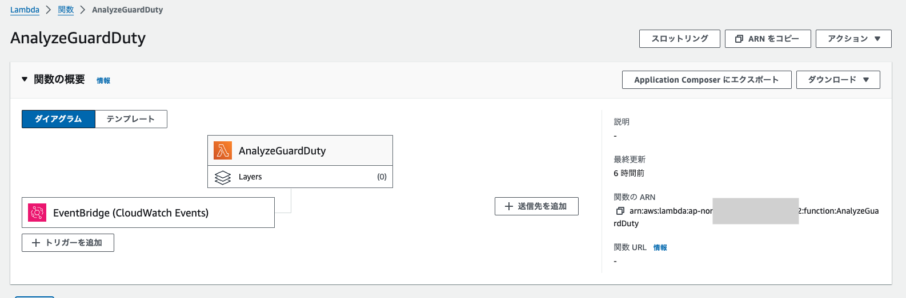

最終的にAWS Lambdaの画面で上記のようになっていれば設定完了です。

### Amazon GuardDutyでサンプルのFindingを生成し一連のフローをテストする

それでは最後に全体を通してテストします。
今回はテストなのでGuardDutyのサンプルのFindingを生成します。

- Amazon GuardDutyの「設定」画面に遷移します
- 「検出結果サンプルの生成」を選択します

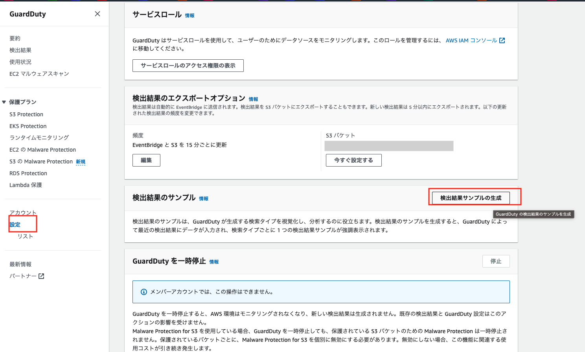

数分後に、GuardDutyのサンプルのFindingが生成されます。ワークフローが実行、Slackへ通知が届いたら成功です。

### ワークフローのログを確認

ワークフローのログ画面で、どのようなデータが入って、途中のプロセスでどのような処理が行われたかを確認できます。

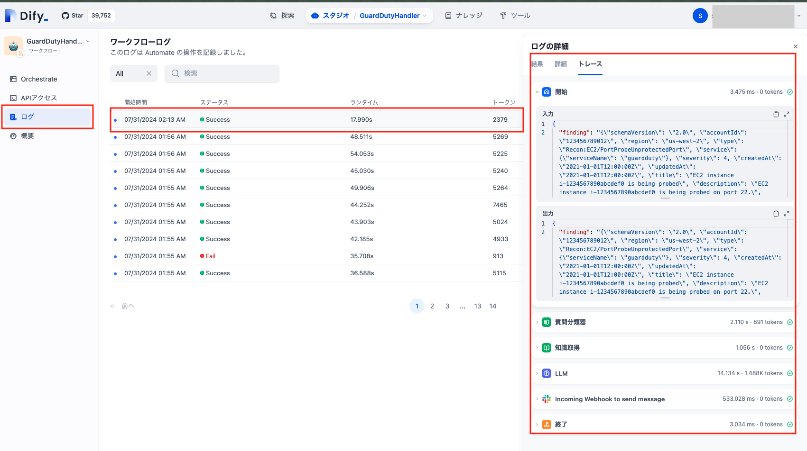

## 終わりに

いかがでしたでしょうか。今回はGuardDutyのデータを処理しましたが、LLMを利用することでどんなセキュリティのイベントも解析が可能になります。（AWS CloudTrailやアクセスログなど）
イベントログの解析だけでなく、レポート生成やRunbookの作成、リカバリーや封じ込めの対応なども柔軟に行うことができそうです。

まずはみなさんのセキュリティ業務で特に頻度が高く負担になっているところからワークフロー作成を検討してはいかがでしょうか。

Difyのようなツールを使った環境が構築できれば、エンジニアではなくてもワークフローを組むことができるようになります。さらに組み込みのツールが豊富で、今回利用したSlack連携以外にも、WEBサーチや、チケット管理システムへの登録や、既存のAPIへの連携などが可能です。

セキュリティオペレーションの自動化のハードルがますます下がってきましたね。今後もLLMや周辺のツールのアップデートに期待です。
